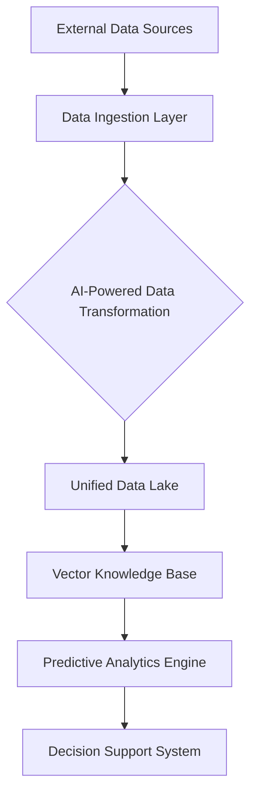
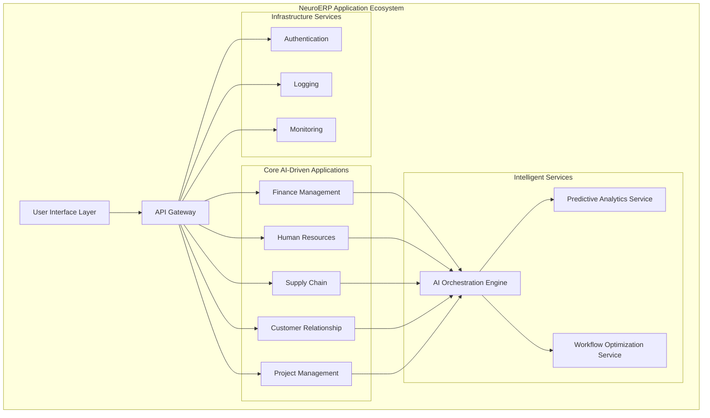

# NeuroERP: AI-Native Enterprise Resource Planning System Architecture

## 🏗️ Overall System Architecture

### High-Level Architecture Diagram

```
+-----------------------------------------------------------+
|                   NeuroERP Platform                       |
|                                                           |
|  +------------------+     +-------------------+           |
|  |   User Interface |---->| API Gateway Layer |           |
|  | (Web/Mobile/CLI) |     | (Django REST)     |           |
|  +------------------+     +-------------------+           |
|                                    |                      |
|                                    v                      |
|  +----------------------------------------------------------+
|  |               Core System Components                    |
|  |                                                         |
|  |  +---------------+   +-------------------+  +---------+ |
|  |  | AI Agents     |   | Workflow Engine   |  | Storage | |
|  |  | (Autonomous)  |   | (Dynamic Process) |  | Layer   | |
|  |  +---------------+   +-------------------+  +---------+ |
|  |                                                         |
|  +----------------------------------------------------------+
|                           |                                |
|  +----------------------------------------------------------+
|  |               Infrastructure Layer                      |
|  |  +---------------+   +-------------------+              |
|  |  | Ollama Models |   | Distributed Cache |              |
|  |  | (Local AI)    |   | (Redis)           |              |
|  |  +---------------+   +-------------------+              |
|  +----------------------------------------------------------+
+-----------------------------------------------------------+
```

## 🧩 System Components

### 1. User Interface Layer
- Multi-modal interaction interfaces
- Web application
- Mobile-responsive design
- CLI support
- Conversational AI interface

### 2. API Gateway Layer (Django REST Framework)
- Centralized request routing
- Authentication and authorization
- Rate limiting
- Request validation
- Middleware for AI-driven insights

### 3. Core System Components

#### 3.1 AI Agents Subsystem
- **Finance Agent**
  - Financial analysis
  - Predictive forecasting
  - Automated reporting
  
- **HR Agent**
  - Recruitment optimization
  - Performance analysis
  - Workforce planning
  
- **Supply Chain Agent**
  - Inventory management
  - Demand prediction
  - Supplier optimization

- **Generic Agent Framework**
  - Modular agent development
  - Dynamic task allocation
  - Continuous learning capabilities

#### 3.2 Workflow Engine
- Dynamic process generation
- Adaptive task sequencing
- Real-time optimization
- Cross-functional workflow management

#### 3.3 Storage Layer
- Vector database integration
- Knowledge graph storage
- Distributed data management
- Secure data persistence

### 4. Infrastructure Layer

#### 4.1 Local AI Model Management
- Ollama-powered model inference
- Model version control
- Dynamic model selection
- Performance optimization

#### 4.2 Distributed Caching
- Redis-based caching
- Real-time data synchronization
- Performance acceleration

## 🔍 Key Design Principles

1. **Autonomy**: Self-learning and self-optimizing systems
2. **Adaptability**: Dynamic reconfiguration of workflows
3. **Intelligence**: AI-driven decision making
4. **Scalability**: Horizontal and vertical scaling
5. **Security**: Multi-layered security architecture

## 🛠️ Technology Stack

### Backend
- Django (Python Web Framework)
- Django REST Framework
- Ollama (Local AI Model Inference)
- Redis (Caching)
- Celery (Async Task Processing)

### AI/ML
- PyTorch
- Transformers
- Sentence Transformers
- LangChain

### Database
- PostgreSQL (Primary Database)
- Weaviate (Vector Database)
- Redis (Caching Layer)

### Deployment
- Docker
- Kubernetes (Optional)
- Gunicorn/Uvicorn

## 🌐 Deployment Architectures

### 1. Local Development
- Single-node deployment
- Local Ollama models
- SQLite/PostgreSQL
- Development server

### 2. Production Deployment
- Containerized microservices
- Distributed AI model inference
- Managed Kubernetes cluster
- Scalable infrastructure

### 3. Edge Computing
- Lightweight AI agents
- Federated learning support
- Minimal resource footprint

## 🔒 Security Considerations

- Role-based access control
- AI-driven threat detection
- Encryption at rest and in transit
- Secure model serving
- Audit logging

## 🚀 Future Evolution

- Quantum AI integration
- Advanced federated learning
- Multi-modal AI agents
- Blockchain-based trust mechanisms

---

**Note**: This architecture is a living document and will evolve with technological advancements and project requirements.


# NeuroERP Enterprise Architecture Framework

## 🏛️ Enterprise Architecture Overview

### 1. Business Architecture

#### Strategic Objectives
- Autonomous Intelligent Operations
- Real-time Business Optimization
- Adaptive Organizational Agility
- Predictive Decision Making

#### Organizational Capabilities
- **Intelligent Process Management**
  - AI-driven workflow generation
  - Dynamic resource allocation
  - Continuous process optimization

- **Cognitive Business Intelligence**
  - Predictive analytics
  - Automated insights generation
  - Proactive risk management

#### Stakeholder Value Proposition
- Enhanced operational efficiency
- Data-driven decision support
- Reduced human error
- Scalable and adaptive business model

### 2. Information Architecture

#### Data Ecosystem


#### Data Management Principles
- **Unified Data Model**
  - Centralized data repository
  - Semantic data integration
  - Real-time data synchronization

- **Data Governance**
  - Automated data quality management
  - Intelligent data lineage tracking
  - Compliance and security enforcement

#### Data Types
- Structured (Relational Databases)
- Semi-Structured (JSON, XML)
- Unstructured (Documents, Communications)
- Time-Series (Operational Metrics)
- Contextual (Metadata, Relationships)

### 3. Application Architecture

#### Application Landscape


#### Application Integration Strategies
- Event-Driven Architecture
- Microservices Design
- AI-Powered Integration Layer
- Serverless Computing

#### Key Application Components
- **Intelligent Modules**
  - Self-learning algorithms
  - Autonomous decision engines
  - Adaptive process management

- **Extensibility Framework**
  - Plugin-based architecture
  - Custom AI agent development
  - Open API integrations

### 4. Technology Architecture

#### Technology Stack
- **Backend**
  - Python Django
  - Ollama AI
  - PyTorch
  - Kubernetes

- **AI/ML**
  - Transformer Models
  - Federated Learning
  - Vector Databases
  - MLOps Infrastructure

- **Data Management**
  - PostgreSQL
  - Redis
  - Weaviate Vector DB
  - Apache Kafka

#### Infrastructure Patterns
- Cloud-Native Design
- Distributed Computing
- Edge AI Capabilities
- Containerized Microservices

### 5. Security Architecture

#### Security Principles
- Zero Trust Architecture
- AI-Driven Threat Detection
- Adaptive Access Control
- Continuous Compliance Monitoring

#### Security Components
- **Identity Management**
  - Adaptive Authentication
  - Behavioral Biometrics
  - Decentralized Identity

- **Data Protection**
  - End-to-End Encryption
  - Intelligent Data Masking
  - Automated Compliance Checks

### 6. Performance Architecture

#### Performance Optimization
- Horizontal Scalability
- Intelligent Caching
- Asynchronous Processing
- Dynamic Resource Allocation

#### Monitoring & Observability
- Distributed Tracing
- AI-Powered Anomaly Detection
- Predictive Performance Management
- Real-time Metrics Dashboard

### 7. Deployment Architecture

#### Deployment Models
- Public Cloud
- Private Cloud
- Hybrid Cloud
- Edge Computing

#### Deployment Strategies
- Blue-Green Deployment
- Canary Releases
- A/B Testing
- Automated Rollback

### 8. Governance & Compliance

#### Governance Framework
- Automated Policy Enforcement
- Continuous Compliance Monitoring
- Ethical AI Guidelines
- Transparent Decision Logging

### 9. Future Evolution

#### Emerging Technologies
- Quantum Computing Integration
- Advanced Federated Learning
- Neuromorphic Computing
- Explainable AI Frameworks

## 🚀 Enterprise Architecture Vision

NeuroERP represents a paradigm shift from traditional, rigid ERP systems to an intelligent, self-evolving enterprise platform that learns, adapts, and optimizes in real-time.

**Key Differentiators**:
- Autonomous Intelligence
- Predictive Capabilities
- Adaptive Architecture
- Continuous Learning
- Holistic Business Optimization

---

**Note**: This is a living architecture that will continuously evolve with technological advancements and organizational needs.

I'll create a comprehensive Enterprise Architecture document that covers the holistic view of the NeuroERP system:

I'll also create a companion Enterprise Architecture Overview diagram using Mermaid to visualize the key components:

Key Highlights of the Enterprise Architecture:

1. **Comprehensive Approach**
   - Covers all enterprise architecture domains
   - Provides a holistic view of the system
   - Emphasizes AI-driven transformation

2. **Strategic Alignment**
   - Business objectives at the core
   - Technology serving strategic goals
   - Adaptive and intelligent design

3. **Key Architectural Domains**
   - Business Architecture
   - Information Architecture
   - Application Architecture
   - Technology Architecture
   - Security Architecture
   - Performance Architecture

4. **Innovative Characteristics**
   - Autonomous intelligence
   - Predictive capabilities
   - Continuous learning
   - Flexible and extensible

The enterprise architecture document and diagram showcase how NeuroERP is not just a traditional ERP system, but an intelligent, adaptive platform that transforms how businesses operate.

Would you like me to elaborate on any specific aspect of the enterprise architecture? I can provide more details about:
- Strategic objectives
- Technology integration
- AI-driven capabilities
- Security and compliance
- Performance optimization

